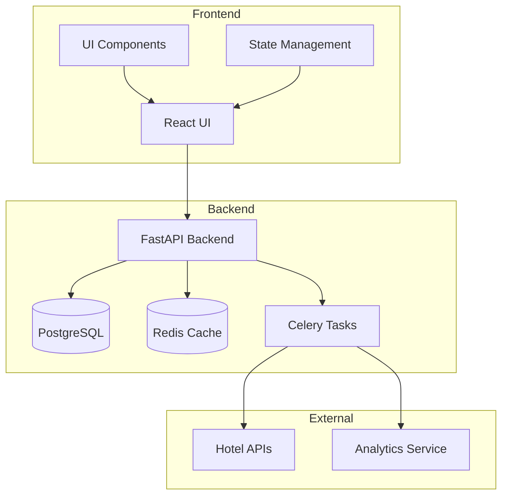
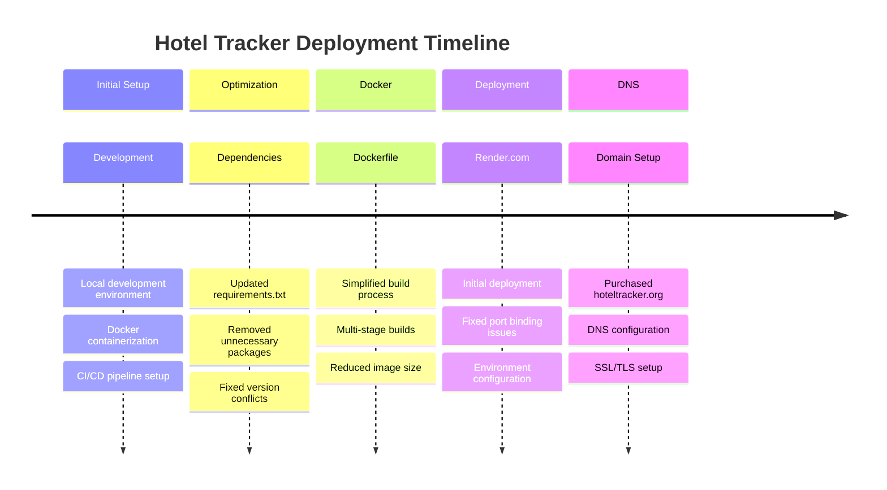
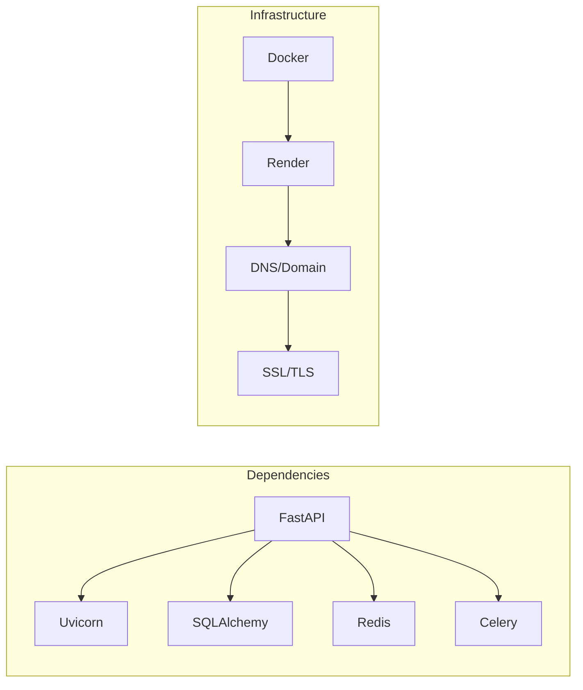
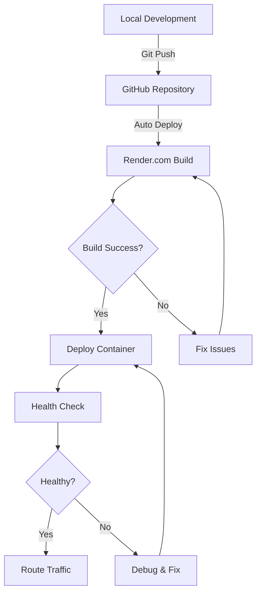
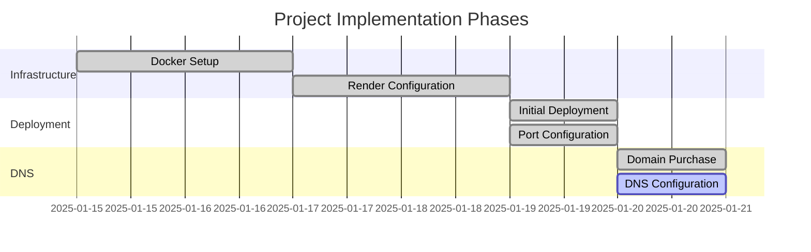
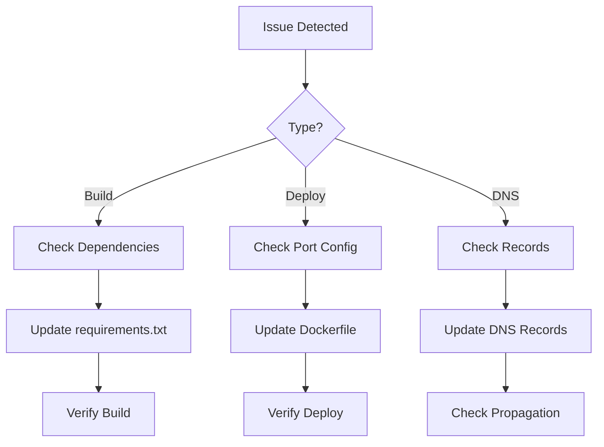

# Hotel Tracker Project Roadmap

## 1. Project Architecture

## 2. Deployment Journey

## 3. Component Dependencies

## 4. Deployment Configuration Flow

## 5. Key Milestones

## 6. Issue Resolution Flow

